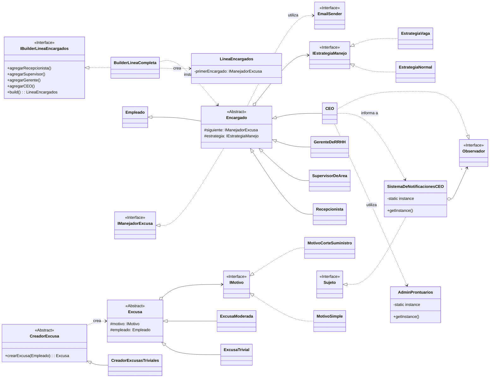

# Excusas S.A. - Sistema de Gestión de Excusas

## Patrones de Diseño Implementados

* **Chain of Responsibility:** Modela la línea de mando (`Recepcionista` -\> `Supervisor` -\> `Gerente` -\> `CEO`) por la que viaja una excusa hasta ser procesada.
* **Strategy:** Permite cambiar el comportamiento de un `Encargado` (`Normal`, `Vago`, `Productivo`) sin alterar su clase, encapsulando cada comportamiento en un objeto separado.
* **Builder:** Proporciona una API fluida para construir la compleja cadena de responsabilidad de una manera ordenada y legible.
* **Bridge:** Desacopla la abstracción de una `Excusa` (ej. `ExcusaTrivial`) de la implementación de su `Motivo` (ej. `MotivoSimple`), permitiendo que ambos varíen de forma independiente.
* **Factory Method:** Encapsula la lógica de creación de los objetos `Excusa`, combinando la abstracción y la implementación correctas del patrón Bridge.
* **Observer:** Permite que los `CEO`s se suscriban a un sistema central de notificaciones para ser avisados cuando otro `CEO` registra un prontuario.
* **Singleton:** Garantiza una única instancia para el `AdminProntuarios` y para el `SistemaDeNotificacionesCEO`, gestionando recursos compartidos de forma centralizada.

## Diagrama de Clases (UML)

